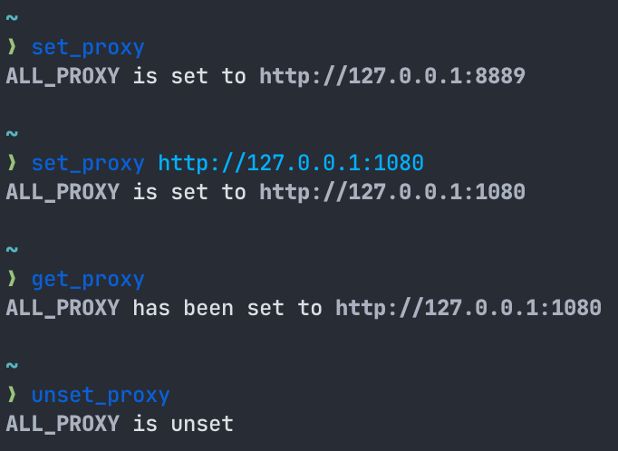

# 🐟🌐 proxy.fish

[Fish](https://fishshell.com/) plugin for querying and (un)setting proxy environment variables.



## Installation

- [plug.fish](https://github.com/kidonng/plug.fish)

  ```sh
  plug install kidonng/proxy.fish
  ```

- [Fisher](https://github.com/jorgebucaran/fisher)

  ```sh
  fisher install kidonng/proxy.fish
  ```

## Usage

Configure desired proxy variables in `$proxy_vars` before using the following functions, e.g. `set -U proxy_vars ALL_PROXY`.

### `get_proxy`

Display variables in `$proxy_vars` in a readable format.

- `-a/--all` display the following variables instead of `$proxy_vars`:
  - `$ALL_PROXY` / `$all_proxy`
  - `$HTTP_PROXY` / `$http_proxy`
  - `$HTTPS_PROXY` / `$https_proxy`
  - `$FTP_PROXY` / `$ftp_proxy`

### `set_proxy [server]`

Set variables in `$proxy_vars` to the specified server. **This action affects all sessions.**

- `-a/--all` set all variables listed above.
- `-g/--global` set variables in current session only.
- If no server is specified, the plugin will try to get it from system proxy config:
  - macOS: via `scutil`

### `unset_proxy`

Unset (erase) variables in `$proxy_vars`. **This action affects all sessions.**

- `-a/--all` unset all variables listed above.
- `-g/--global` unset variables in current session only.

## Related

- Oh My Fish [`proxy` plugin](https://github.com/oh-my-fish/plugin-proxy)
